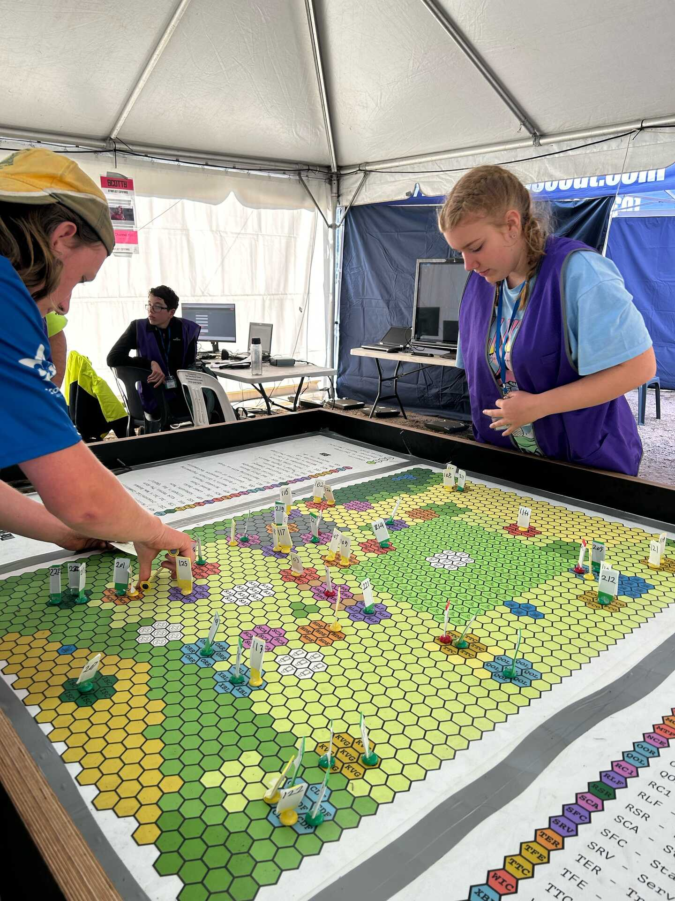

Content Summary:

1. Introduction & Motivation
   a. Introduce speakers
      - mattcen: Linux systems administrator, software developer
      - Luke: security analyst & systems architect; interests in web development
        & security education
      - Both Amateur Radio Operators
      - Both members of STEM (Science, Tech, Engineering, Maths) team of Scouts
        Victoria
      - Scouts Victoria: "Youth Lead, Adult Supported" organisation. Focus:
        - empowering young people to pursue fun & adventurous activities they
          want to do
        - facilitating safe participation in:
          - camping
          - climbing
          - sailing
          - cycling
          - our specialties: radio communications & web development

   b. Talk Outline
      - Background about organisation and problems we're trying to solve
      - Description of evolving solutions we've developed; high level, with some
        technical detail, time permitting

   c. Introduce organisational goals
      - Scouting has come a long way from camping in the bush and tying knots
      - We leaders are hellbent on supporting young people to provide better
        resources to both Scouting and wider community

   d. Organisation limitations
      - Our volunteer-run organisation isn't always resourced to work as efficient
        as we'd like
      - Some IT systems are dated; think PHP apps from the early 2000s
      - Haven't grown to meet changing organisational needs due to limited resources
      - Organisation is unique and not well-served by off-the-shelf products

   e. Supporting a Legion of Devs with Python
      - We've considered raising a "Legion of Devs" to perpetuate volunteer-led
        development & growth of Scouting information tools
      - We chose Python for its similarity to English, and its ubiquitous use in
        schools and tech programs
      - These traits make Python and its frameworks friendly to young coders

2. Brownsea

   a. About ScoutHack
      - ScoutHack: A weekend-long WebDev course
      - Walks Scouts aged ten to adult through HTML, CSS, Python Flask
      - Lightning Talk summary: [Everything Open
        2023](https://www.youtube.com/watch?v=GGgHsA8WifE&t=1460)
      - Full length presentation: [Developing Labs for Teaching Kids
        Webdev](https://www.youtube.com/watch?v=VXFuL5PcPKI)
      - Not covering this today though; let's discuss the registration app we
        built

   b. Registration System needs
      - Registration for a Scouting event poses some administrative burdens we
        felt empowered to overcome:
        1. FIXME: Complex point/concept: When a registration system doesn't allow
           administrators to collect information such as dietary requirements, or
           group people together for dormitory allocations or similar,
           administrators typically export editable spreadsheets to facilitate
           this. In addition to duplicating information and having potentially
           outdated copies, it means PII (Personally Identifiable Information) is
           floating around on users' devices and may not be secure.

           We wanted to discourage this risk by providing as much tooling as
           possible within the interface, so users didn't feel the need to create
           exports.
        2. Avoid paying a third party provider that only does half of what we
           need
        3. Use a system that understands the unique structure of the organisation
      - In summary, our need is to:
        1. Allow registered members to sign up for an event
        2. Prefill the minimum essential PII from our membership database
        3. Auto-generate an invoice from our accounting system
        4. Summarise dietary needs at a glance
        5. And as a proficient user, have the whole process take about 60 seconds

   c. Registration System capabilities
      - Welcome to Brownsea!
        - Named after the first Scout camp held by Lord Robert Baden-Powell on
          Brownsea Island, England in 1907
      - Brownsea integrates with authenticated API endpoints of Extranet, Scouts
        Victoria's membership database
      - The API has two purposes:
        1. Given a surname, date of birth, and membership number, confirm if
           they match an active Scouts Victoria membership record.

           I hate that we make assumptions about the format of people's names, but
           that is thus far beyond our control.
        2. Given a membership number, return minimal information about that
           member:
           - Name
           - Email address
           - Phone number
           - Age (years, as an integer)
           - List of roles within the organisation, including name of Scout
             Group(s)
      - FIXME: More info here

   d. Limiting data storage needs

   e. Ease and speed of use

3. CQ, CQ, CQ: RadioActiv8
   a. Introduce RA8
   b. Introduce Radio Contesting
   c. Contesting into youth program
   d. RadioActiv8 concept
   e. RadioActiv8 gameplay
   f. RadioActiv8 - does it scale?
   g. Digitizing RadioActiv8
   h. RadioActiv8 is Youth Led!
   i. RadioActiv8 Interface
   j. Expanding capability (Yes, it scales)

4. Star Trek: Survival (2022, 2024)

5. Wrap-up
   a. Evidence of success

---

# 1. Introduction & Motivation

## 1.a. Introduce Speakers

mattcen is a Linux systems administrator and software developer; Luke is a security analyst and systems architect with interests in web development and security education. We are also both Amateur Radio Operators, and members of the STEM (Science, Technology, Engineering, Maths) team of Scouts Victoria.

Scouts Victoria is a "Youth Lead, Adult Supported" organisation focused on empowering young people to pursue fun and adventurous activities they want to do, and facilitating their safe participation in camping, climbing, sailing, cycling, and our specialties, radio communications and website development.

## 1.b. Talk Outline

We'll start with a little backstory about us and the organisation, and touch on the problems we're trying to solve.

Then we'll describe the evolving solutions we've developed, initially at a high level, but getting into a bit of the technical detail, time permitting.

## 1.c. Introduce organisational goals

Scouting has come a long way from camping in the bush and tying knots, and as Leaders, we are hellbent on continuing to engage young people in providing better resources to both Scouting and the wider community.

## 1.d. Organisation Limitations

As an organisation run by volunteers, we don't always have the resources to work as efficiently as we'd like. Some of our IT systems are dated (think PHP sites from the early 2000s) and due to limited resources, haven't always grown as the organisation's needs have changed. Our organisation is unique in its structure, and isn't well-served by off-the-shelf products.

## 1.e. Supporting a Legion of Devs using Python

Luke and I have often considered the value of raising a "Legion of Devs" to perpetuate volunteer-led development and growth of Scouting information tools. Python with its supportive framework is a natural colleague to this challenge, with Python being a friendly and familiar language to young coders through school and tech programs already well established. Python, along with its frameworks, is an obvious solution due to its ubiquity in early coding education spaces.

# 2. Brownsea

<!--
FIXME: This is verbose. Remove from talk, but keep this as a note.

Building a Legion of Devs is ambitious, and starting that process at age 10 is insanity. We have learnt that teaching young people to code can never be started too early - how this is achieved is much more important. While there is a plethora of excellent coding resources that teach kids to build games or spin turtles on their local machines, we found that sharing information is not only a skill for life, but one of the most rewarding tech experiences for young people to see the fruit of their labour. Given the ubiquity of information accessible to young people via websites, it seems obvious that web development is the best place to start building skills with a tangible outcome.
-->

## 2.a. About ScoutHack

So we created ScoutHack, a WebDev course that walks Scouts aged ten to adult through HTML, CSS, and Python Flask. Check out our [Lightning Talk from Everything Open 2023](https://www.youtube.com/watch?v=GGgHsA8WifE&t=1460) for a little more about that adventure, or mattcen's talk, [Developing Labs for Teaching Kids Webdev](https://www.youtube.com/watch?v=VXFuL5PcPKI) for a deeper dive. Today we're discussing the registration app built to support event registrations - our first app in our trenchcoat!

## 2.b. Registration System needs

Registration for a Scouting event poses some administrative burdens we felt empowered to overcome.

FIXME tidy up phrasing:

FIXME: Option 1: Firstly, minimise the need for an event administrator to export (and thus duplicate/exfiltrate) registration data in order to augment it with information such as catering or grouping.

FIXME: Option 2: Firstly, minimize the need for data exfiltration and duplication as a solution to support event functions like catering and grouping.

Secondly, avoid paying a third party provider that only does half of what we need.

Thirdly, use a system that understands the unique structure of the organisation.

In summary, our need is to:

1. Allow registered members to sign up for an event
2. Prefill the minimum essential PII from our membership database
3. Auto-generate an invoice from our accounting system
4. Summarise dietary needs at a glance
5. And as a proficient user, have the whole process take about 60 seconds.

## 2.c. Registration System capabilities

Welcome to Brownsea! Named after the first Scout camp held by Lord Robert Baden-Powell on Brownsea Island in England in 1907, this system integrates with authenticated API endpoints of Extranet, Scouts Victoria's membership database.

This API does the following:

   1. Given a surname, date of birth, and membership number, confirm if they match an active Scouts Victoria membership record

      I wish that we didn't assume people have surnames, but this is currently beyond my control.
2. Given a membership number, return minimal information about that member:

   - Name
   - Email address
   - Phone number
   - Age (years, as an integer)
   - List of roles within the organisation, including name of Scout Group(s)

We now have a viable system for any event administrator to manage the event details for our organisation.

FIXME: More info for above paragraph

## 2.d. Limiting data storage needs

Our goal is to store minimal PII (Personally Identifiable Information) and streamline the sign-up experience by avoiding _requesting_ information that we could get from the existing membership database, and still allowing members to override system-provided information if desired.

We achieved this by only allowing registration using valid member-database authorization credentials, forcing members to update their membership records if there are data inaccuracies or mismatches, and allowing authorized registrants could override the data presented by the membership registration database if they needed to use other contact details for the purpose of the event.

## 2.e. Ease and speed of use

Brownsea has made it trivial for members to sign up to ScoutHack, and immediately receive a Xero invoice both in the interface and via email (the system doesn't accept credit card payments currently). This results in a sign up and receive an invoice process taking, literally, 30 seconds:

<video controls src="images/Brownsea-rego.mp4" width="720"></video>

Now we have members registered to participate, it's time for some program. Let's play with some radios!

FIXME: Wait wait, we don't have them sorted into Patrols; we don't even know what a Patrol *is* at this stage!

# 3. CQ, CQ, CQ: RadioActiv8

### 3.a. Introduce RA8

As our State Leader of Communication Technologies, Luke wanted to replicate the exciting experience of Amateur Radio Contesting as an activity for Scouts.

### 3.b. Introduce Radio Contesting

FIXME: "We're running a program for youth that relies on radio communication" - the background into contesting isn't necessary, and is currently confusing

A metaphor of fishing (with a rod, not a mail server), the joy of contesting is found in making contact with another radio station, exchanging callsigns, location, and a custom serial identifier, before searching for another contact - the station with the most contacts wins the contest, so speed and efficiency are rewarded.

### 3.c. Contesting into youth program

Contests had already proved interesting and exciting to our Youth members, so why not simulate the experience as a next-generation wide game[^WideGame]? In its simplest form, scouts would use two-way radios to receive instructions and relay information while running around a park.

[^WideGame]: wide game (n) (plural wide games): Any of various games played by groups in a large area, such as a field or woodland.

### 3.d. RadioActiv8 concept

FIXME: Rephrase "grid" and "matrix" etc

The principle of RadioActiv8[^RA8Name] is quite straightforward: Bases are set out across a neighbourhood park or Scout Camp. Each base has a two-way radio, and a sign with the name of the base and an intelligence grid featuring an answer matrix.

[^RA8Name]: Wordplay on the use of two-way radios, the active component of moving between bases, "activate", and "radioactive". Abbreviated to RA8

### 3.e. RadioActiv8 gameplay

FIXME: Remove jargon: Team instead of Patrol, Question/Answer instead of Intelligence, Home Base instead of HQ station

At the start of the game, each patrol[^Patrol] is sent to a base. Once they arrive, they radio to HQ and identify themselves and current location. The HQ station responds with a question which the patrol must answer using the intelligence answer matrix. On receipt of an answer HQ provides the patrol a new destination. The game's end condition (and whether it is competitive) is up to the facilitator's discretion. The proof-of-concept used a sheet of paper to track the game state[^GameState] of patrols, recorded by Luke while we gave contacts the next base to attend.

[^Patrol]: A group of 4-7 scouts

[^GameState]: the current and previous locations of each patrol, and which questions they'd answered

### 3.f. RadioActiv8 - does it scale?

Obviously this approach doesn't scale well, and can get overwhelming quickly for an inexperienced operator to manage. Increasing scale necessitated multiple radio operators at HQ trying to write on the same sheet of paper with hilarious and chaotic results, but was not optimal with a high number of patrols and bases, so we sought a better solution.

FIXME: We introduce Django and CRUD below, but should move some of this up to the Brownsea section

### 3.g. Digitizing RadioActiv8

What we needed was a CRUD[^CRUD] app, and having recently begun experimenting with Django, mattcen was _definitely_ feeling like a perfectionist with deadlines[^DjangoSlogan], so reached for it immediately.

[^CRUD]: [Create, Read, Update, Delete](https://en.wikipedia.org/wiki/Create,_read,_update_and_delete)

[^DjangoSlogan]: Django's slogan is "The web framework for perfectionists with deadlines." as per their [website header](https://www.djangoproject.com/)

### 3.h. RadioActiv8 is Youth Led!

FIXME: clean up this wording. #phrasing, boom

After a few trial sessions, we refined the app so effectively that the complex contest concepts became a simple process to follow. This was so effective that the entire game could be independently managed by older Scouts with minor support from us.
FIXME: Improve alt text

### 3.i. RadioActiv8 Interface

This form is laid out in a logical order. When a patrol first contacts HQ, we want their patrol name or number. Once we have that, the system can suggest, based on previous data, where that patrol is expected to be, pre-fill their current location, offer an intelligence question if relevant, and suggest a destination based on various heuristics. The operator can confirm whether the intelligence was answered correctly, and then if the patrol is checking out of the base, they can confirm the destination is sensible, and send the patrol on their way.

### 3.j. Expanding capability (Yes, it scales)

After successfully running RadioActiv8 as one of several dozen activities at a state-wide scout event, and getting great feedback, we were keen to find other uses for this platform. For example, each base only has intelligence on a card, but what if the base was an activity base that had a task to complete?

RadioActiv8 would work really well for distributing Youth members to different activities, and so we began putting together ideas as to how this application would work to facilitate management of a Scouting event, rather than just being an activity for its own sake.

FIXME: Also mention ScoutSafe implications of being able to track youth across a large area

TODO: Show RA8 dashboard listing base capacity and patrol locations

---

--- We are here ---

# 4. Star Trek: Survival (2022, 2024)

The best way to teach a young person (or anyone, really) is to make it fun and engaging. The more fun the activity, the less obstruction to focus and learning. Immersion of experience, much like chocolate on vegetables, is a great way to discover new skills and explore self-capability without feeling the burden of pressure to learn. To that end, we have devlivered not one, but two [_Star Trek: Survival_'s](https://startreksurvival.tech/), "an _immersive_ adventure experience for all Scouting Members". This website forms the third app in our trenchcoat.

We have supported many STEM-based activities at conventional Scouting events, but now that we have a versatile registration system and a dynamic and gamified distribution utility, we decided to combine these activities into an immersive program experience.

The idea was that we'd take over one of Scouts Victoria's largest Scout camps, invite various Activity Teams to each run activity, and use RadioActiv8 to run the entire event by sending patrols to activities based on pre-selected patrol preferences, walking distance, activity capacity, and availability.

The first step was to create a _Star Trek: Survival_ website. The Program team compiled a list of 18 individual activities for the 2022 event, with 18 additional activities added to the 2024 event.

Each activity was published online, and included an immersive Trek-themed narrative, and a list of "I can..." skill-based statements that facilitate Scouts Australia's award scheme components, ready for peer-review and presentation back to their Scout Groups post-event.

FIXME: Get an "I Can" statement list from STS mission [e.g](https://startreksurvival.tech/mission/captain-dirgos-folly/#mission_outcomes)

Then into the STS[^STS] website, we added the Brownsea and RadioActiv8 Django applications, and mapped these into the STS website's various models.

[^STS]: _Star Trek: Survival_

As always, we sought a straightforward, user-friendly workflow for both members and organisers -- for the most part, this was achieved as a minimum viable product with room to grow.

<del>The idea was:</del>
The combined workflow follows:

FIXME: phrasing this sentence

1. Member uses Brownsea to sign up using their Scouts Victoria membership information
2. As part of sign-up, the member can select which activities interest them
3. As the event nears, organisers creates patrols of members in the same group or district, taking each member's activity preferences into account where possible
4. These scout groups' leaders can sign in (again using their Scouts Vic membership details) to check which of their members have registered, and which patrols they've been allocated to.
5. When the event begins, every member is checked in using Brownsea's admin portal, given a 2-way radio to keep, and sets up camp with their patrol.
6. When activities begin, each patrol is sent off to one of the activities on their priority list.
7. On arrival at their activity, the patrol checks in by radioing their identity and location to the RadioActiv8 team at Starfleet Command (which is also one of the activities), does the activity, and checks out the same way.
8. This continues throughout the weekend, and each patrol gets to complete _most_ of their preferred activities.
9. After the weekend, each member can access a web page listing which award scheme components they have achieved, based on which activities they actually got to throughout the event.

Both Brownsea and RadioActiv8 required additional features to facilitate STS. Some of these features were generically useful for most events, but a small subset were specific to STS and carefully kept on a separate branch.

One of Django's huge advantages in an endeavour like this is its admin app. I was able to give event administrators access to the admin without writing them a custom portal up-front, and in general it was Good Enough™ for their needs.

#### Post-event tech review

From a technical perspective, we wanted to do our best to adhere to current industry best practices for the tools we used. Django is obviously a well-understood and battle-tested framework. As much as possible, we run all of our Django apps as 12-factor apps in Docker containers to make them easy to deploy anywhere and migrate where necessary. As our goal is for these apps to be maintainable by youth members who may be very novice programmers, we want to reduce what they have to learn. As a result, we're doing what we can to standardise on HTMX for the interactive parts of RadioActiv8, so that people don't need to know JavaScript or another front-end framework.

## 5.a. Evidence of success

Under our Youth Lead, Adult Supported approach and assisted by the process driven layout of the RadioActiv8, we are able to have our youngest scouts to be able to contribute to running STS, so here are some Joey Scouts in Starfleet Command, dispatching patrols of peers and seniors to their various other bases. Content warning: Cute youth members.

To guide our dispatch team to make operational decisions, RadioActiv8 uses comprehensive dashboards that include the base capacity, last known location of each patrol, and when we last heard from them. We're yet to develop an interactive map showing everyone's locations but is on the to-do list. To overcome this for our visual and kinesthetic learners, our colleague designed an A0 table-top gaming-style map of the entire campsite and its activities, with which Starfleet Command personnel could use to visually track the location of each patrol:

Using RadioActiv8, Brownsea, and the STS website in an integrated fashion helped us to minimize the administrative functions of supporting the delivery of the Scouting program, and gave Scouts Victoria the capability to allow simultaneous participation and delivery of the Scouting program.

As a result, we have literally made it possible for the operations of an event to be Youth Led, and Adult Supported. With thanks to the capabilities of Python and Django, we can continue to do perpetuate our success and upskill our members in ways that were only a dream just a few years ago.

---

## Suggestions for tying things together:

- Great UX (re-play video)
- Protection of PII
- Integrations between apps

## Cool stuff

1. Docker containers for ease of dev and deployment
1. The modularity of Django apps; being able to tie together RA8 and Brownsea into STS
1. Custom auth with Extranet
1. Using Scouts Vic hierarchy to grant permissions in Brownsea
1. The Admin; enabling rapid use of the app with just a few models
1. Wagtail for easy CMS functionality
1. Do this with HTMX so folks don't need to learn JavaScript
1. Using AJAX and logic to predict information in RA8 dashboard
1. Dashboard showing base capacity, and locations of patrols and how long since we've heard from them
1. Route/time/distance estimates
1. GeoDjango; make it easy to add geospatial integration into an app

## flow notes from Luke at 11th hour:
[CW: JARGON - we have removed Jargon wherever possible; note that words for some nouns in Scouting have been simplified, i.e. activity instead of mission, teams instead of patrols, etc]
1. We're Scout leaders - we facilitate young people to explore the world with an ethos of Learning by Doing that is Youth Led, Adult Supported.
  a. We don't just do fun things outdoors, but we also provide events like ScoutHack and teach Web Dev (see our lightning talk/Matt's talk).
  b. We also run immersive STEM-themed camps. We call it Star Trek: Survival.
    i. Instead of using a round-robin or "Track-based" program, we decided to have fun with radios and go agile.
    ii. Participants told us their activity preferences, and we yeeted this into our software to make sure everyone did something they asked for to support their badge projects.
    iii. 250 Scouts were each given their own radio (a choice so poor we've done it twice now), and they received their marching orders to attend their next activity from "Starfleet Command".
    iv. All they had to do now was Check In to activity - do activity - Check Out of activity - Next activity. Food and sleep also occur in designated times and areas.

2. To support such insanely ambitious plans, <del>Luke schmoozied up to Matt</del> we very much relied on custom developed apps to:
  a. inform participants of the awesome activities on offer
    i. a website for STS
  b. register participants in a way that protects data, offers quality UX, provides transparency for guardians
    i. a registration system, named after the very first Scouting campsite, Brownsea
  c. gamify the distribution of participants across activity sites in a dynamic way that considered preferences for individuals and their activity team
    i. a despatch system, RadioActiv8, a play on the words Radio, Active, and the totes hip spelling with a number like all the cool kids do. #toTaLHacKeRbRo

3. To do this we needed three apps in a trenchcoat and a way to rapidly deploy should everything fall over like it did 2 hours after Day 1 started.
  a. [ALL] Docker images means that we have a standardized operational environment. Say what you will about micro services being irritating but it does the job effectively.
  b. [ALL] One project to <del>rule</del> host them all - using apps in Django. <maybe show some code?>
  c. [BRN] Verify and pre-fill:
    i. using membership validation to prefill and prompt updating of personal contact information
    ii. Less is more - only gather what is needed; heath records have a dedicated confidential information system, so only catering basics are required.
  d. [BRN] Provide both guardians and Scout leaders who are responsible for youth access to registration information for individuals.
    i. legal guardians can see their child's data
    ii. Scout Leaders can see their Youth Member data (to which they *should* already have access through member records).
  e. [BRN] Event administration is handled by authorised personnel using the Django Admin backend framework.
    i. conveniently, this is already built and was a breeze to customise and to enable bulk field editing.
    ii. Exfiltration of data was limited to Super Users for the purposes of providing catering summaries to our Kitchen staff, and our event communications teams as required. Again, less is more.
  ~~f. [STS] Delegated access to program information control by using Wagtail CMS for activity content - STS missions.
    i. reduces the overhead on git/VCS commit proficiency for maintaining website changes by giving program specialists the ability to edit specific event website content areas, such as the missions.~~
  g. [RA8] Minimize JS by using the impressive capabilities of HTMX.
    i. Single programming language for backend Dev avoiding bespoke or customized areas where, ordinarily, JS would feel like the _only_ way to solve a particular problem.
  h. [RA8] Leveraging AJAX to update information on a realtime dashboard to give up-to-date information without refreshing
    i. Allows for logical decision making without having to consciously think about refreshing to gain the latest information of the status.
  i. [RA8] Use a live dashboard to show the states of change to radio operators.
    i. Helps despatchers to make operational decisions by showing: Base Capacity, Last reported Location, Last time seen.
  j. [RA8] Pre-populate Route/Time estimates between bases
    i. Helps make smart decisions - do you send the 5 year olds on a 1km journey uphill 20mins before lunch? No. Older Scouts? Yes.
  k. [RA8] Use GeoDjango to add geospatial integration to help with mapping.
    i. Speaking of maps...\*show gamified map\*

that's our trench coat. If you're interest in more about ScoutHack and other projects, check out Mattcen's talk.
