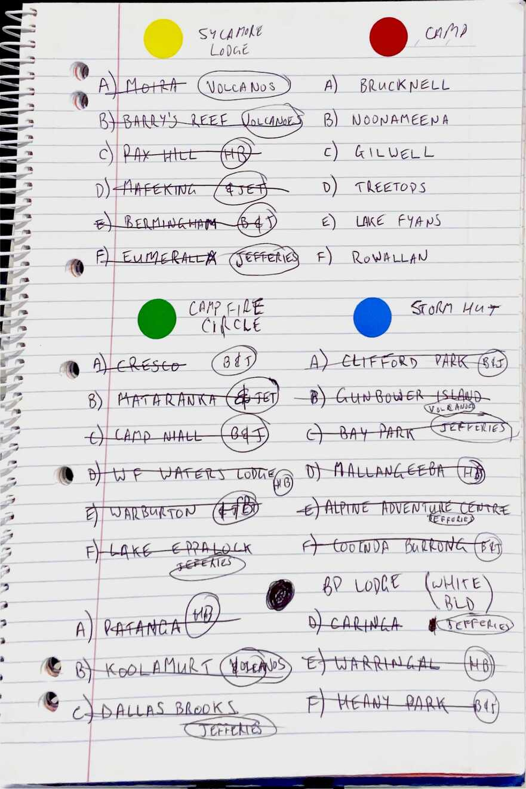

<!-- .slide: data-autoslide="10000" -->

## Three Django Apps in a Trenchcoat

### Writing an event management website with not a lot of time

Matt Cengia
(they/them)

[blog.mattcen.com](https://blog.mattcen.com)

<!--
- Email: mattcen@mattcen.com
- Mastodon: [@mattcen@aus.social](https://aus.social/@mattcen)
- Matrix: [@mattcen:mattcen.com](https://matrix.to/#/@mattcen:mattcen.com)
- Website: [blog.mattcen.com](https://blog.mattcen.com)
- Slides: https://github.com/mattcen/2024-11-three-django-apps-in-a-trenchcoat
-->

License: [CC-BY-SA 4.0](https://creativecommons.org/licenses/by-sa/4.0/)

Note:

- I'm Matt (they/them)
- Find me by handle, M A T T C E N
- Post about talk using #PyConAU and #3AppsInATrenchcoat
- Slides available on GitHub: <https://github.com/mattcen/2024-11-three-django-apps-in-a-trenchcoat>

---

<!-- .slide: data-autoslide="20000" -->

## Slides

Note:

- 5 minutes on the organisational problem
  - want *youth* to be able to maintain this in future (Youth Leading, Adults Supported), for succession planning etc.
  - registration and validation of members
    - brownsea, denizulu (AAA) - simplification by design (less is more - require little info (a) so we don't have to store info, and (b) to reduce friction for user)
  - gamification of event operations
    - RA8
  - communicating to masses
    - STS website, Be Very Informed - internal vs external
- 5 minutes on the technical problem
  - why python
    - simplicity to code/teach (popularity/ubiquity)
  - why django
    - rapid development ("Web framework for perfectionists with deadlines")
    - durable/secure/BCP out of the box
    - extensible
    - Django Admin
  - why docker
    - 12 factor, easy to deploy anywhere
  - why htmx
    - Reduce need for custom javascript, rapid (AJAX) responsiveness
  - why… whatever else
- 15 minutes on the solution
- 5 mins for question time

---

<!-- .slide: data-autoslide="20000" -->

## Acknowledgements

Note:

I'm delivering this presentation on the unceded ancenstral lands of many Indigenous peoples.
I honour the knowledge, stewardship, and care with which they've tended this land throughout history, and recognise the deep and lasting damage that colonisation has inflicted on them.
I pledge to do my best to respect, learn from, and support these peoples. We can all do better.

----

# "Let's make a tech and radio outdoor wide game!"

## "It'll be fun!", he said

> wide game (n) (plural wide games):
>
>  Any of various games played by groups in a large area, such as a field or woodland.

Note:

Luke wanted to create a wide game which uses 2-way to communicate with a home base. Each radio would be at a base out in the field, and patrols of scouts would be sent to one of those bases.

Upon reaching a base, they would use the radio to contact HQ for further instructions. Each base would have a sheet of "intelligence" questions, one of which would be requested by the operator at HQ. Once the scouts answered the intelligence question, HQ would send them to another base.

---

## Getting RadioActiv8 off the ground

----

<!-- .element: class="r-stretch" -->

----

<!-- .element: class="r-stretch" -->

----

<!-- .element: class="r-stretch" -->

----

# "We should build an event registration platform!"

Note:

- multiple intersecting hierarchies
- good user flow
- met specific needs the current system did not
- uses agile development methodology to rapidly build stuff without getting bogged down in policy and bureaucracy

NOTE: 2 audiences:

1. PyConAU
2. Members of Scouts Victoria

----

## "Uh, sure?"

---

## The gathering of Brownsea

----

# "So I wanna run the biggest STEM scout camp in the state…"

## "And I want to make use of these other two apps *and* build a new one!"

---

## Creating Star Trek: Survival

### And getting youth to run it

----

# Lessons learned

---

Note:

# Potential questions

- Why not PHP/Laravel, or some other framework/language
- Why not Node/Javascript
  - One programming language is enough
  - Set out to do as much as we can without JS or another language
- Why Docker as opposed to "bare metal"/VM
  - Lift and shift
  - Scalability
  - Ref needing to migrate STS website at the 11th hour
