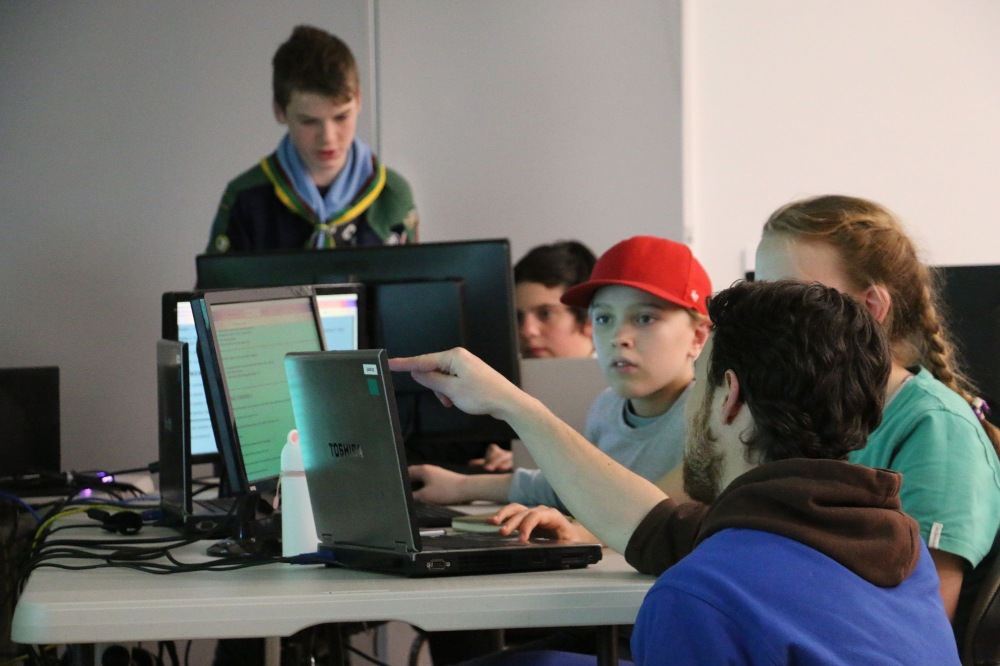
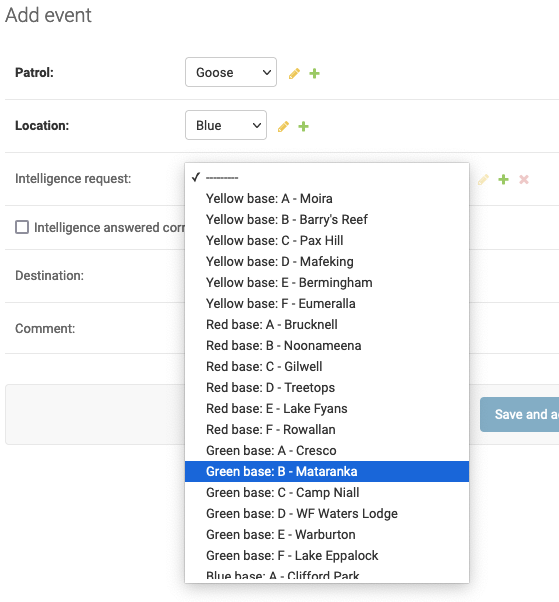
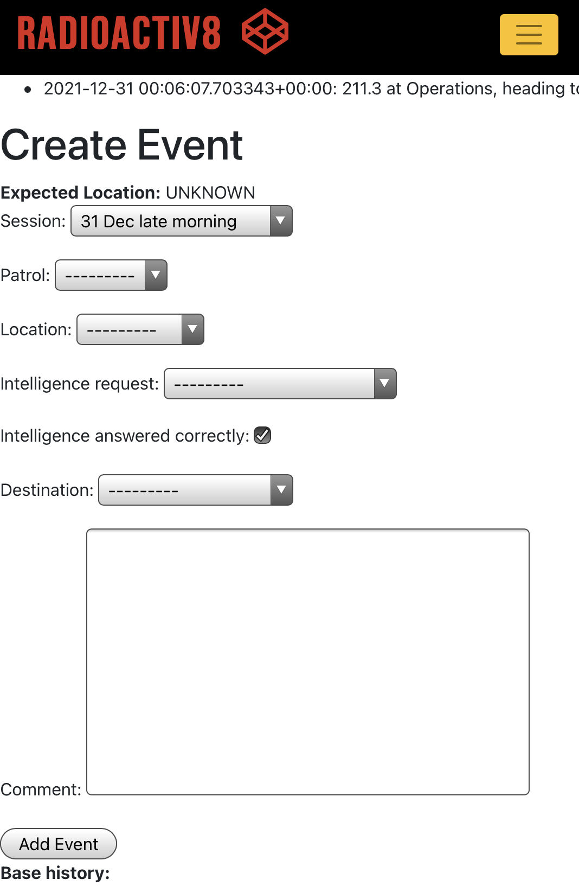
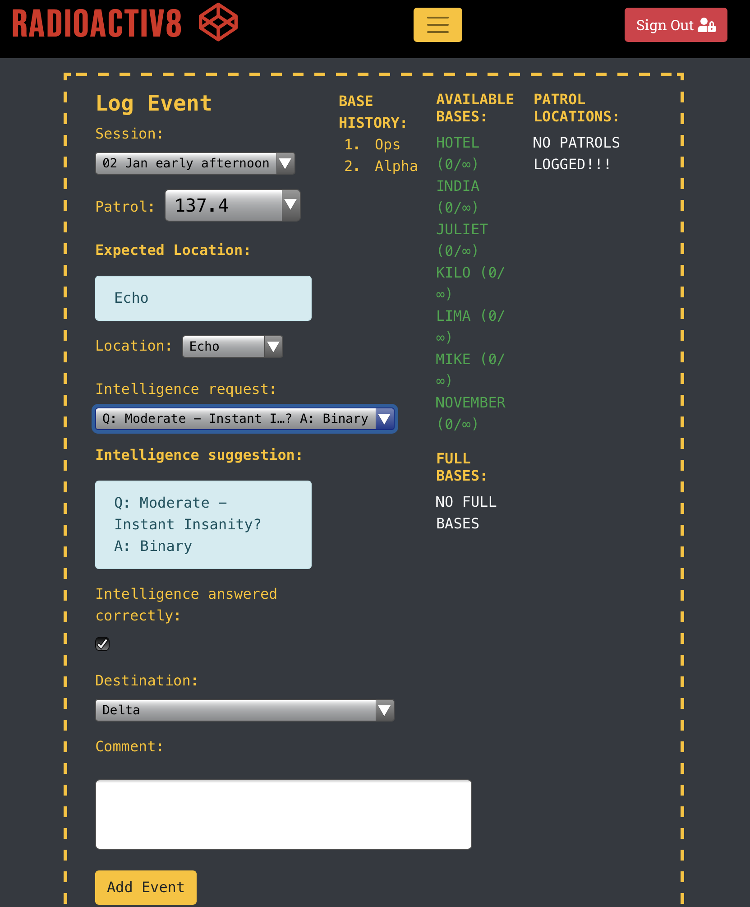
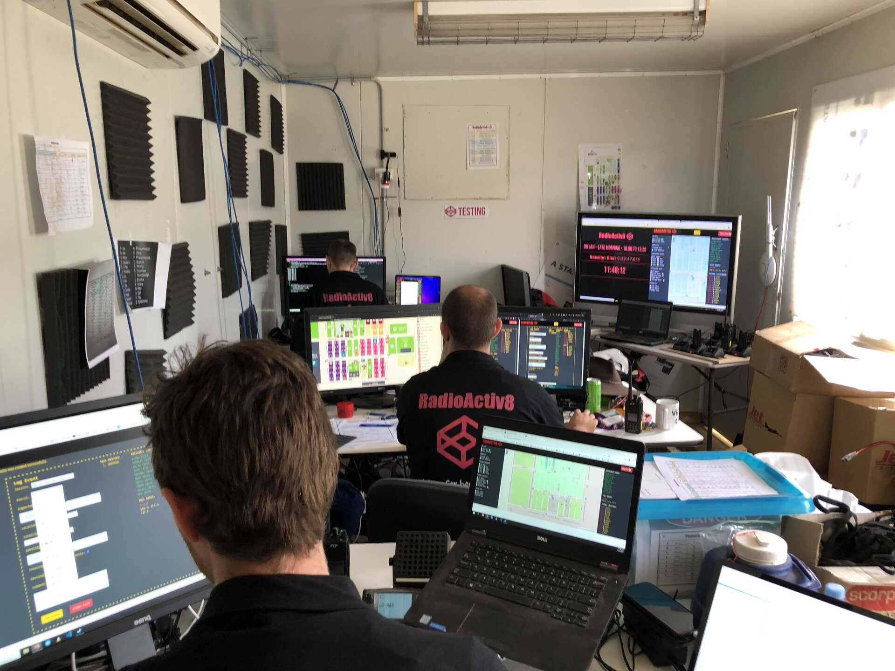
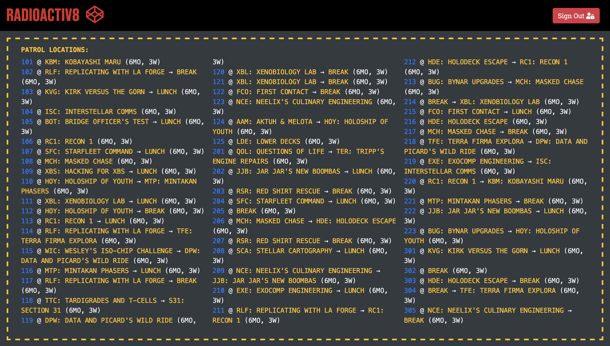
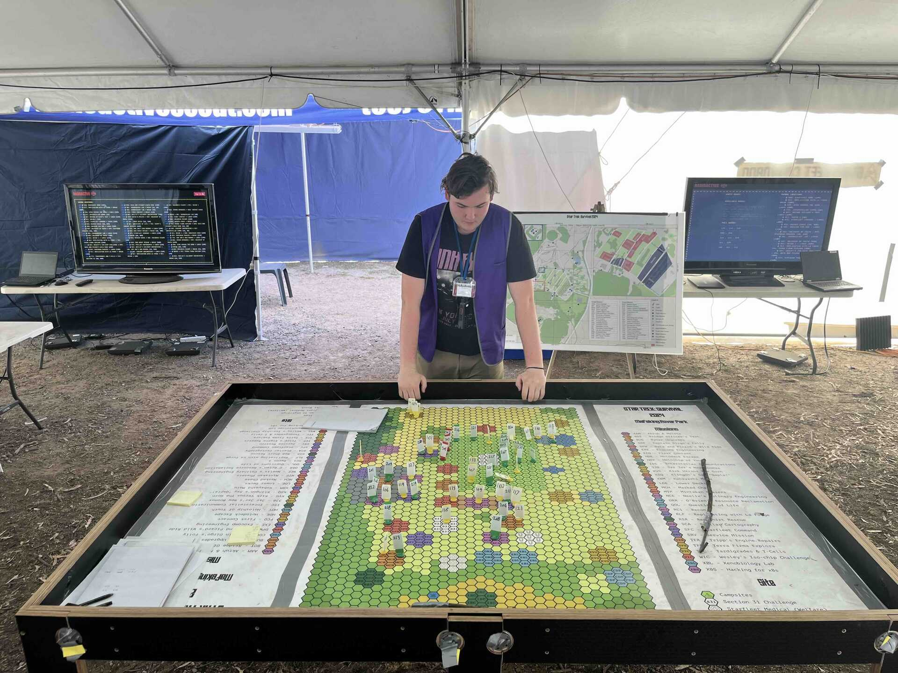

<!-- data-timing="1" .slide: data-visibility="hidden" -->
---
#type: slide
title: "Three Django Apps in a Trenchcoat: Writing an event management website with not a lot of time"
slideOptions:
  theme: white
  transition: none
  hash: true
  hashOneBasedIndex: true
  controls: false
  slideNumber: 'c/t'
  totalTime: 1500
  defaultTiming: 10
  minimumTiming: 5
  autoSlideStoppable: false
  plugins:
  - RevealMarkdown
  - RevealHighlight
  - RevealSearch
  - RevealNotes
  - RevealMath
  - RevealZoom
attributes: |
  <!-- data-timing="1" .slide: data-visibility="hidden" -->
---
<!-- .slide: data-timing="20" -->

## Three Django Apps in a Trenchcoat

### Writing an event management website with not a lot of time

- Matt (mattcen) Cengia (they/them) -- [blog.mattcen.com](https://blog.mattcen.com)
- Luke (ekulbyrnes) Byrnes (he/him) -- [ekulbyrnes.github.io](https://ekulbyrnes.github.io)

License: [CC-BY-SA 4.0](https://creativecommons.org/licenses/by-sa/4.0/)

Note:

- I'm Matt, or mattcen: Linux systems administrator, software developer. I use they/them pronouns
- I'm Luke: systems technician and aspiring security architect; interests in web development & security education

---
<!-- .slide: data-timing="20" -->

## Acknowledgements

Note:

Matt <!-- .element: style="color: blue" -->

We're delivering this presentation on the unceded ancestral lands of many Indigenous peoples.
We honour the knowledge, stewardship, and care with which they've tended this land throughout history, and recognise the deep and lasting damage that colonisation has inflicted on them.
We pledge to do our best to respect, learn from, and support these peoples. We can all do better.

---
<!-- .slide: data-timing="20" -->

## Slides

[](https://mattcen.github.io/2024-11-three-django-apps-in-a-trenchcoat)

[mattcen.github.io/2024-11-three-django-apps-in-a-trenchcoat](https://mattcen.github.io/2024-11-three-django-apps-in-a-trenchcoat)

Note:

Matt <!-- .element: style="color: blue" -->

- Slides available at Github repo link at top of screen
- Live view of slides as we progress through them available via QR Code or link below
- Will give a few seconds for you to grab that link

---

<!-- .slide: data-timing="15" -->


<!-- .element: class="r-stretch" -->

Note:

Luke <!-- .element: style="color: red" -->

We're Scout leaders - we:
- facilitate young people to explore the world
- an ethos of Learning by Doing
- is Youth Led, Adult Supported.

---
<!-- .slide: data-timing="15" -->

<!-- .element style="width: 45%" -->
 <!-- .element style="width: 45%" -->

Note:

Luke <!-- .element: style="color: red" -->

- Sure, we do fun outdoor activities
- But also provide events like ScoutHack which teach website development
- See our Lightning Talk, or Matt's presentation for details on that; links in slide notes
- Lightning Talk summary: [Everything Open 2023](https://www.youtube.com/watch?v=GGgHsA8WifE&t=1460)
- Full length presentation: [Developing Labs for Teaching Kids Webdev](https://www.youtube.com/watch?v=VXFuL5PcPKI)

[Abseiling climbing image credit: Lachlan Bence](https://www.thecourier.com.au/story/8221341/hanging-on-to-build-our-citys-future-leaders-but-they-need-help/)

---
<!-- .slide: data-timing="5" -->


<!-- .element: class="r-stretch" -->

Note:

Luke <!-- .element: style="color: red" -->

- We also run immersive STEM-focussed camps. We call this one Star Trek: Survival.

----
<!-- .slide: data-timing="5" -->

| Rotation | Activity 1    | Activity 2    | Activity 3    |
| -------- | ------------- | ------------- | ------------- |
| 1        | 🔴 Red Team    | 💙 Blue Team   | 🟨 Yellow Team |
| 2        | 🟨 Yellow Team | 🔴 Red Team    | 💙 Blue Team   |
| 3        | 💙 Blue Team   | 🟨 Yellow Team | 🔴 Red Team    |

Note:

Luke <!-- .element: style="color: red" -->

- Most Scouting events use a round-robin or "Track-based" program like this…
- Each team rotates through activities for a limited duration.

----
<!-- .slide: data-timing="3" -->

| Rotation | Activity 1    | Activity 2    | Activity 3    |
| -------- | ------------- | ------------- | ------------- |
| 1        | 🔴 Red Team    | 💙 Blue Team   | 🟨 Yellow Team |
| 2        | 🟨 Yellow Team | 🔴 Red Team    | 💙 Blue Team   |
| 3        | 💙 Blue Team   | 🟨 Yellow Team | 🔴 Red Team    |

<!-- .element style="text-decoration: line-through" -->

Note:

Luke <!-- .element: style="color: red" -->

- …We don't do that.

Youth-Led means youth members decide how long they want to be throwing sponges at their Leaders before exploring something else.

We have made that decision capability a reality.

----
<!-- .slide: data-timing="35" -->


<!-- .element: class="r-stretch" -->

Note:

Luke <!-- .element: style="color: red" -->

- At STS we went agile
- built the event around a dispatch system to send youth members to their activities via radio

Shown here:
- Game board: an analogue representation of the game-state reported by our software
- In background: screen showing digital dashboard showing game state
- Around table: Youth updating team locations
- Off to side: Adult supporting

----
<!-- .slide: data-timing="25" -->

<video data-autoplay controls>
  <source src="images/sts-mission-scroll.mp4" type="video/mp4">
  <meta itemprop="description" content="Mission snapshot showing 36 missions">
  <meta itemprop="url" content="https://startreksurvival.tech/mission/">
</video>

Note:

Luke <!-- .element: style="color: red" -->

[STS]

- To make an agile system work, participants gave us their top ten activity preferences
- we yeeted this into our software to make sure everyone did something they asked for to support their badge projects.
- we doubled our program from 18 activities in 2022 to 36 activites in 2024.

----
<!-- .slide: data-timing="10" -->


<!-- .element: class="r-stretch" -->

Note:

Luke <!-- .element: style="color: red" -->

- 250 Scouts were each given their own radio (a choice so poor we've done it twice now)
- they received their marching orders to attend their next activity from "Starfleet Command".

----
<!-- .slide: data-timing="25" -->


<!-- .element: class="r-stretch" -->

Check IN: Do activity

Check OUT: Request next activity

Note:

Luke <!-- .element: style="color: red" -->

To engage in activities at this event, all the teams have to do to participate is:

- Check In to designated activity
- Do activity
- Check Out of activity
- Head to next designated activity

This methodology provided flexibility of staff, scalability of activity delivery, and most importantly, no queueing for fun!

Food and sleep also occur in designated times and areas.

---
<!-- .slide: data-timing="10" -->


<!-- .element: class="r-stretch" -->

Note:

Luke <!-- .element: style="color: red" -->

- An event of this style had never been achieved before.

- To support such outrageously ambitious plans, ~~Luke schmoozied up to Matt~~ we very much relied on custom developed apps:

---
<!-- .slide: data-timing="15" -->

#### Django App 1
_Star Trek: Survival_ website

Explain the event and showcase the activities on offer

Note:

Luke <!-- .element: style="color: red" -->

- first Django app, a nice and simple concept
- create a website for STS to inform participants of the awesome activities on offer

----
<!-- .slide: data-timing="30" -->

#### Django App 2

_Brownsea_: Event Management System

Simple, secure, and speedy sign-up

Note:

Luke <!-- .element: style="color: red" -->

- used for participant registration and team management
- implemented for speed
- security of personal data
- offers quality UX
- provides transparency for guardians

Matt <!-- .element: style="color:blue"-->

- Critically: This was successfully implemented despite Scouts Victoria's complex hierarchical arrangement
- Designed generically, extensibly, and with modularity
- Allows us to capture key elements of event management
- Crucially, it works *beyond* the needs of just our event
- So other Scouting events can use this as well

----
<!-- .slide: data-timing="20" -->

#### Django App 3

_RadioActiv8_: the event controller

Dispatch and event operations as an activity for all youth members

Note:

Luke <!-- .element: style="color: red" -->

- Outsourcing the operational components of the event as an activity for youth members
- by gamifying the distribution of participants across activity sites
- maintains preference consideration for individuals and their activity teams
- The name RadioActiv8 is a play on the words Radio, Active, and the totes hip spelling of script kiddies. #toTaLHacKeRbRo

---

<!-- .slide: data-timing="10" -->

 <!-- .element style="width: 30%; margin: 0 auto" -->
 <!-- .element style="width: 30%; margin: 0 auto" -->
 <!-- .element style="width: 30%; margin: 0 auto" -->

<!-- .element style="justify-content: center; display: flex" -->

Note:

Matt <!-- .element: style="color:blue" -->

- To make _Star Trek: Survival_ a success:
- Packed our 3 apps into a trenchcoat
- Single, standardized environment so that
- In case everything should fall over…
- Like it did 2 hours into Day 1 of our event

----
<!-- .slide: data-timing="15" -->


Note:

Matt <!-- .element: style="color: blue" -->

- Fortunately, we aimed for 12-factor apps to enable rapid redeployment
- We used OCI-compliant images helped us standardise our environment
- And chose Docker's container engine to run our containers
- To learn more about Docker, see [my Docker talk](https://www.youtube.com/watch?v=X0aarx6LLzI), linked in the slide notes
- This made it easy to spin up on new infrastructure if necessary

!FIXME[Cut me and merge info if shortening required?]

---
<!-- .slide: data-timing="1" -->


<!-- .element: class="r-stretch" -->

Note:

Matt <!-- .element: style="color: blue" -->

[BRN]
- For our event registration system, we wanted a smooth user experience
- To access our event portal, we only require:
  - Their membership number
  - Their surname*
  - Their date of birth
- We don't store their date of birth; it's just used to authenticate against the Scouts Victoria membership API

\* Yes, I wish we didn't make assumptions about the format of people's names, too.

----
<!-- .slide: data-timing="1" -->

<video data-autoplay controls>
  <source src="images/Brownsea-rego.mp4" type="video/mp4">
  <meta itemprop="description" content="Video showing 30-second registration process">
</video>

Note:

Matt <!-- .element: style="color: blue" -->

[BRN]
Registration Process Highlight
- validate members with membership database;
- prefill and prompt replacement of personal contact information for the event
- let member provide any notes that may be beneficial to event organisers (but not health info)
- and let them provide a cursory summary of catering/dietary needs
- then they receive invoice for payment.

----
<!-- .slide: data-timing="1" -->

### Appropriate Info, Appropriate Access

No more, no less.

Note:

Luke <!-- .element: style="color: red" -->

[BRN]
- We only gather data that is needed
- heath records have a dedicated confidential information system, so only catering needs are flagged to event admins.
- We use an intentionally separate health information provider, so as an event we don't need to manage that data flow here.

----
<!-- .slide: data-timing="1" -->


<!-- .element: class="r-stretch" -->

Note:

Matt <!-- .element: style="color: blue" -->

[BRN]
- legal guardians can sign in to see their children's data…

----
<!-- .slide: data-timing="1" -->


<!-- .element: class="r-stretch" -->

Note:

Matt <!-- .element: style="color: blue" -->

[BRN]
- … And Scout Leaders can see their Youth Member data
- (to which they *should* already have access through member records)

----
<!-- .slide: data-timing="1" -->


Note:

Matt <!-- .element style="color: blue" -->

[BRN]
- Event administration is handled by authorised personnel using the Django Admin backend framework.
- We see here the different activities can be switched on, off, and have content updated on the fly through this interface.

---
<!-- .slide: data-timing="1" -->


<!-- .element: class="r-stretch" -->

Note:

Luke <!-- .element: style="color:red" -->

[RA8]

Now for some fun.

RadioActiv8 has multiple modes of play - it can be a radio wide game, and it can be used to dispatch participants to activities at an event!

----
<!-- .slide: data-timing="1" -->


<!-- .element: class="r-stretch" -->

Note:

Luke <!-- .element: style="color:red" -->

- At the start of the game, each partcipant team is sent to a base.
- Once they arrive, they radio to HQ and identify themselves and current location.
- The HQ station responds with a question to which the team must return an answer via radio.
- On receipt of an answer, HQ provides the team a new destination.
- The game's end condition (and whether it is competitive) is up to the facilitator's discretion.

Easy, right? Let's record this, and then lets use this process to run an event!

----

<!-- .element: class="r-stretch" -->

Note:

Matt <!-- .element: style="color: blue" -->

- The proof-of-concept used a sheet of paper to track the game state of teams, recorded by Luke while we gave contacts the next base to attend.

- Learning: Paper does not scale.

---
<!-- .slide: data-timing="1" -->

 <!-- .element: style="" -->

Note:

Matt <!-- .element style="color:blue" -->

- The Radio Conversation process is built into the form workflow
- Operators iterate the process from top of screen
- Delivered by Django Admin's "interface-for-free."

---
<!-- .slide: data-timing="1" -->

<!-- .element style="width: 100%" -->

Note:

Matt <!-- .element: style="color: blue" -->

- Here we see the events - a log of each entry, tracking
  - the last known **location** of each team at a given time
  - the "INTEL" collected, featuring correct/incorrect flagging.
  - the next base they've been sent to.

----
<!-- .slide: data-timing="1" -->


<!-- .element: class="r-stretch" -->

Note:

Matt <!-- .element: style="color: blue" -->

- Now we create front-end styling, and a state-of-play dashboard to help with decision making.

----
<!-- .slide: data-timing="1" -->


<!-- .element: class="r-stretch"-->

Note:

Matt <!-- .element: style="color: blue" -->

- … and then we match Luke's style guide. For better or worse.

---

<!-- .slide: data-timing="1" -->


<!-- .element: class="r-stretch" -->

Note:

Matt <!-- .element: style="color: blue" -->

- and add some buttons, specific for the event.
- some of the apps needed minor code forks to customise some apps for the event
- We can see the app provides feedback if entered info doesn't match its view view of the world
- RadioActiv8 is smart enough to say something is wrong…
- …allows the operator to override suggestions, letting play continue

---
<!-- .slide: data-timing="1" -->

<!-- .element style="width: 28%" -->
<!-- .element style="width: 50%" -->

Note:

Luke <!-- .element style="color:red"-->

- Wide games are fun, but this same process can be used to manage activities.
- Instead of intel bases, we use activities.
- This means HQ needs to be a little bigger than before, but with Youth-Led, Adult Supported, we can go from this…

----

<!-- .slide: data-timing="1"-->

<!-- .element style="width: 45%" -->
<!-- .element style="width: 31%" -->

Note:

- Here are our operators - an older Scout, helping a younger scout, direct OTHER scouts on where to go next!
- This is how we made outsourcing event operations possible:

----

<!-- .slide: data-timing="5"-->

Team class using registration app data

<!--https://github.com/Scouts-Victoria-Program/RadioActiv8/blob/b3b19a481be39f49c3b627bd4ef3653eeecc7c99/django/RadioActiv8/models.py#L228-L233-->
```python
class Patrol(models.Model):
    history = HistoricalRecords()
    event_patrol = models.ForeignKey(
        "scoutsvic_ems.EventPatrol",
        blank=True,
        null=True,
        on_delete=models.SET_NULL,
        )
```
<!-- .element: style="width: fit-content" -->

Team information accessed by Foreign Key from registration app

<!--https://github.com/Scouts-Victoria-Program/scoutsvic-rego/blob/638b6ad775430d9e7158499daa7395dec21c3ac6/django/scoutsvic_ems/models.py#L563-->
```python
class Registration(RulesModel):
    class Meta:
        rules_permissions = {
        …
        patrol = models.ForeignKey(
            Patrol,
            on_delete=models.SET_NULL,
            null=True,
            blank=True)
        …
        }
```
<!-- .element: style="width: fit-content" -->

Note:

Matt <!-- .element: style="color:blue" -->

- So back to our Trenchcoat
- we created One project to ~~rule~~ host them all:
- A single multi-app Django project

!FIXME[@mattcen read and re-write slides and notes however you see fit.]

----

<!-- .slide: data-timing="5"-->

Blending three apps <!--https://github.com/Scouts-Victoria-Program/sts/blob/e012c21e7c6d87e898c005fe4191f728efb0c8ba/django/myproject/settings.py#L88-L91
-->
```python
INSTALLED_APPS = [
    …
    "sts_website",
    "scoutsvic_extranet",
    "scoutsvic_ems",
    "RadioActiv8",
]
```
<!-- .element: style="width: fit-content" -->

Note:

Matt <!-- .element: style="color: blue" -->

- App installation is as easy as
- a list
- a submodule update!

!FIXME[@mattcen read and re-write slides and notes however you see fit.]


----
<!-- .slide: data-timing="1" -->

 <!-- .element style="width: 30%" -->
 <!-- .element style="width: 30%" -->
 <!-- .element style="width: 30%" -->

Note:

Matt <!-- .element: style="color: blue" -->

[BRN, STS, RA8]
- Here we have an overview of the django model elements.
- Team members sign in with credentials referenced in the ScoutsVic_Extranet app
- They Register for the event via ScoutsVic_EMS (Brownsea)
- As part of Registration, they select their preferred activities, connected to PatrolPreferences in the STS app
- When activities start and a Patrol or team, checks in, the system consults their linked PatrolPreferences to select a candidate for their next activity
- Each Base, or activity, also has GPS coordinates and route distance/time estimates to each other activity so we don't make teams walk too far

---

<!-- .slide: data-timing="1" -->


<!-- .element: class="r-stretch"-->

Note:

!FIXME[@mattcen, do you want to do all of this one instead of me starting?]

Luke <!-- .element: style="color: red" -->

RadioActiv8 provides path-trace distancing between bases, shown as time. Combined with a site map, operators make tactical decisions, such as

> Do we send the 5 year olds on a 1km journey, uphill, 20mins before lunch? No.

> Do we send the Older Scouts? Yes.

Matt <!-- .element: style="color:blue" -->

- Each base recommendation populates Route/Time estimates between bases
- we use GeoDjango to add geospatial integration to help with mapping data.

!FIXME[What else do you want to showcase here @mattcen?]

- Success message displays at the top of the page and includes:
 - A timestamp
 - the Team Number
 - the Current Base
 - and their next Base (if in transit).

- AKA: Wait, what did I just log!?

---
<!-- .slide: data-timing="1" -->

<!-- .element style="width: 28%" -->
<!-- .element style="width: 70%" -->

Note:

Matt <!-- .element: style="color: blue" -->

There are two dashboards shown on the monitors.

- Each
  - uses HTMX to give up-to-date information without refreshing
  - Supports the decision making process for despatchers without manually refreshing the page.
- the Base Dashboard on the left shows
  - Available Bases
  - Base Capacity
  - and Full bases
- the Team Dashboard on the right
 - Lists teams by number
 - Shows either:
  - Their Current Location if one base is listed, or
  - their previous and next base, indicating they are in transit.
 - and the time since they last radio'd HQ.

----

<!-- .slide: data-timing="1" -->

```html
<script src=""></script>
<div id="base-status" class="form-group"
    hx-trigger="every 10s"
    hx-get=""
    hx-target="this"
    hx-select="#base-status"
    hx-swap="outerHTML"
    hx-select-oob="#patrol-locations">
```
<!-- .element: style="width: fit-content" -->

Note:

Matt <!-- .element: style="color: blue" -->

[github link to code](https://github.com/Scouts-Victoria-Program/RadioActiv8/blob/dcbffd2fa4d6f28ba72804422b84d9601b86fd60/django/RadioActiv8/templates/RadioActiv8/master/heading.html#L15)
[github link to code](https://github.com/Scouts-Victoria-Program/RadioActiv8/blob/dcbffd2fa4d6f28ba72804422b84d9601b86fd60/django/RadioActiv8/templates/RadioActiv8/master/play.html#L38)

!FIXME[Talk about the HTMX dependencies/installation?]
- Code is all the HTMX needed to auto-refresh the dashboards.
- Minimize JS by using the impressive capabilities of HTMX.
- Single programming language for backend Dev avoiding bespoke or customized areas where, ordinarily, JS would feel like the _only_ way to solve a particular problem.

---
<!-- .slide: data-timing="1" -->


<!-- .element: class="r-stretch"-->

Note:

Luke <!-- .element: style="color: red" -->

- This "tactical table" setup was very popular, and had youth members of all ages racing to update the sprites on the board after reading the screens.
- Pictured here is the young person in command of this whole operation activity, at only 17 years of age.

---

<!-- .slide: data-timing="1" -->

<!-- .element style="width: 30%" -->
<!-- .element style="width: 30%" -->

Note:

Luke <!-- .element: style="color: red" -->

RadioActiv8 was initially developed for VicJam 2022, a state-wide Jamboree for Scouts.
The first front-end interface was written on day one of the event after months of model-testing.

----
<!-- .slide: data-timing="1" -->


<!-- .element: class="r-stretch"-->

Note:

Matt <!-- .element: style="color: blue" -->

- event operations outsourcing went so well
- our Event Operations Manager spent most of his time like this
- when he wasn't playing with the tabletop pieces.

---
<!-- .slide: data-timing="1" -->

CONTENT WARNING!

Note:

Speaker <!-- .element: style="color: orange" -->

Cuteness overload ahead

---
<!-- .slide: data-timing="1" -->


<!-- .element: class="r-stretch" -->

---
<!-- .slide: data-timing="1" -->


<!-- .element: class="r-stretch" -->

Note:

Luke <!-- .element: style="color: red" -->

This project would not be as efficient without the contributions of many people. From development and testing to trial and error, we all did a little learning by doing.

While the code base carries a lot of the work, this would not be possible without the wonderful team at Scouts Victoria.

There is one people in particular who carried their weight and then some - please thank `@mattcen, everybody.`

---
<!-- .slide: data-timing="1" -->


<!-- .element class="r-stretch" -->

Note:

Matt <!-- .element: style="color:blue" -->

!FIXME[Add your own closing thoughts. I pre-filled something to nod to Python/Django teams, but whatever you like best.]

Django is very much for Perfectionists with Deadlines, and we squished all three apps into a very successful trenchcoat.
<!--https://dev.to/terieyenike/what-is-django-first-impressions-3m60-->

Our thanks to the contributors to this excellent framework.

# Potential questions

- Why not PHP/Laravel, or some other framework/language
- Why not Node/Javascript
  - One programming language is enough
  - Set out to do as much as we can without JS or another language
- Why Docker as opposed to "bare metal"/VM
  - Lift and shift
  - Scalability
  - Ref needing to migrate STS website at the 11th hour
