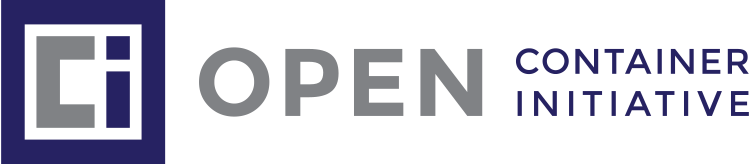

<!-- data-timing="1" .slide: data-visibility="hidden" -->
---
#type: slide
title: "Three Django Apps in a Trenchcoat: Writing an event management website with not a lot of time"
slideOptions:
  theme: white
  transition: none
  hash: true
  hashOneBasedIndex: true
  controls: false
  slideNumber: 'c/t'
  totalTime: 1500
  defaultTiming: 10
  minimumTiming: 5
  autoSlideStoppable: false
  plugins:
  - RevealMarkdown
  - RevealHighlight
  - RevealSearch
  - RevealNotes
  - RevealMath
  - RevealZoom
attributes: |
  <!-- data-timing="1" .slide: data-visibility="hidden" -->
---

<!-- .slide: data-timing="20" -->

## Three Django Apps in a Trenchcoat

### Writing an event management website with not a lot of time

- Matt (mattcen) Cengia (they/them) -- [blog.mattcen.com](https://blog.mattcen.com)
- Luke (ekulbyrnes) Byrnes (he/him) -- [ekulbyrnes.github.io](https://ekulbyrnes.github.io)

License: [CC-BY-SA 4.0](https://creativecommons.org/licenses/by-sa/4.0/)

Note:

- I'm Matt, or mattcen: Linux systems administrator, software developer. I use they/them pronouns
- I'm Luke: security analyst & systems architect; interests in web development & security education

---

<!-- .slide: data-timing="20 -->

## Acknowledgements

Note:

Matt <!-- .element: style="color: blue" -->

We're delivering this presentation on the unceded ancestral lands of many Indigenous peoples.
We honour the knowledge, stewardship, and care with which they've tended this land throughout history, and recognise the deep and lasting damage that colonisation has inflicted on them.
We pledge to do my best to respect, learn from, and support these peoples. We can all do better.

---

<!-- .slide: data-timing="20 -->

## Slides

[mattcen.github.io/2024-11-three-django-apps-in-a-trenchcoat](https://mattcen.github.io/2024-11-three-django-apps-in-a-trenchcoat)

Note:

- Slides available at Github repo link at top of screen
- Live view of slides as we progress through them available via QR Code or link below
- Will give a few seconds for you to grab that link

---

<!-- .slide: data-timing="15" -->

<!-- .element: class="r-stretch" -->

## Quality Scout Leaders

Note:

~~Compulsive volunteers~~

Luke <!-- .element: style="color: red" -->

1. We're Scout leaders - we facilitate young people to explore the world with an ethos of Learning by Doing that is Youth Led, Adult Supported.

- Scout Leaders
- Help young people explore the world
- Cultivate ethos of Learning By Doing
- and Youth Led, Adult Supported

---

<!-- .slide: data-timing="15" -->

 <!-- .element style="width: 45%" -->
 <!-- .element style="width: 50%" -->

Note:

Luke <!-- .element: style="color: red" -->

a. We don't just do fun things outdoors, but we also provide events like ScoutHack and teach Web Dev (see our lightning talk/Matt's talk).

- Sure, we do fun outdoor activities
- But also provide events like ScoutHack which teach website development
- See our Lightning Talk, or Matt's presentation for details on that; links in slide notes

- Lightning Talk summary: [Everything Open 2023](https://www.youtube.com/watch?v=GGgHsA8WifE&t=1460)
- Full length presentation: [Developing Labs for Teaching Kids Webdev](https://www.youtube.com/watch?v=VXFuL5PcPKI)

[OAS image credit, Scouts Victoria](https://www.instagram.com/scoutsvictoria/p/DB7UflsP9lL/?img_index=2)

---

<!-- .slide: data-timing="5" -->

<!-- .element: class="r-stretch" -->

Note:

Luke <!-- .element: style="color: red" -->

b. We also run immersive STEM-focussed camps. We call it Star Trek: Survival.

----

<!-- .slide: data-timing="5" -->

| Rotation | Activity 1    | Activity 2    | Activity 3    |
| -------- | ------------- | ------------- | ------------- |
| 1        | 🔴 Red Team    | 💙 Blue Team   | 🟨 Yellow Team |
| 2        | 🟨 Yellow Team | 🔴 Red Team    | 💙 Blue Team   |
| 3        | 💙 Blue Team   | 🟨 Yellow Team | 🔴 Red Team    |

Note:

Luke <!-- .element: style="color: red" -->

i. Most Scouting events use a round-robin or "Track-based" program like this…

----

<!-- .slide: data-timing="3" -->

| Rotation | Activity 1    | Activity 2    | Activity 3    |
| -------- | ------------- | ------------- | ------------- |
| 1        | 🔴 Red Team    | 💙 Blue Team   | 🟨 Yellow Team |
| 2        | 🟨 Yellow Team | 🔴 Red Team    | 💙 Blue Team   |
| 3        | 💙 Blue Team   | 🟨 Yellow Team | 🔴 Red Team    |

<!-- .element style="text-decoration: line-through" -->

Note:

Luke <!-- .element: style="color: red" -->

- …We don't do that.

----

<!-- .slide: data-timing="5" -->

<!-- .element: class="r-stretch" -->

Note:

ii. For STS, we decided to go agile and use a dispatch system to send youth members to their activities.

----

<!-- .slide: data-timing="25 -->

<video data-autoplay controls>
  <source src="images/sts-mission-scroll.mp4" type="video/mp4">
  <meta itemprop="description" content="Mission snapshot showing 36 missions">
  <meta itemprop="url" content="https://startreksurvival.tech/mission/">
</video>

Note:

Luke <!-- .element: style="color: red" -->

iii. To make an agile system work, participants gave us their top ten activity preferences, and we yeeted this into our software to make sure everyone did something they asked for to support their badge projects.

----

<!-- .slide: data-timing="10" -->

<!-- .element: class="r-stretch" -->

Note:

Luke <!-- .element: style="color: red" -->

iv. 250 Scouts were each given their own radio (a choice so poor we've done it twice now), and they received their marching orders to attend their next activity from "Starfleet Command".

----

<!-- .slide: data-timing="25" -->

## Activity Engagement

- Check In to designated activity
- Do activity
- Check Out of activity
- Head to next designated activity

Note:

Luke <!-- .element: style="color: red" -->

v. To engage in activities at this event, all the teams have to do to participate is:

- Check In to designated activity
- Do activity
- Check Out of activity
- Head to next designated activity

This methodology provided flexibility of staff, scalability of activity delivery, and most importantly, no queueing for fun!

Food and sleep also occur in designated times and areas.

---

<!-- .slide: data-timing="10" -->

> Shoot for the moon. Even if you miss, you'll land among the stars.

—Norman Vincent Peale

Note:

Luke <!-- .element: style="color: red" -->

1. An event of this style had never been achieved before.

To support such outrageously ambitious plans, ~~Luke schmoozied up to Matt~~ we very much relied on custom developed apps:

---

<!-- .slide: data-timing="15" -->

#### Django App 1
_Star Trek: Survival_ website

Explain the event and showcase the activities on offer

Note:

Luke <!-- .element: style="color: red" -->

a. inform participants of the awesome activities on offer by creating a website for STS

Matt <!-- .element: style="color: blue" -->

The first Django app, a nice and simple concept.

----

<!-- .slide: data-timing="30" -->

#### Django App 2

_Brownsea_: Event Management System

Simple, secure, and speedy sign-up

Note:

Luke <!-- .element: style="color: red" -->

b. register participants in a way that is fast, protects personal data, offers quality UX, and provides transparency for guardians

Matt <!-- .element: style="color:blue"-->

- ~~Critically, this was successfully implemented despite the complexity of the organisation's hierarchical arrangement.~~
- Critically: Successfully implemented despite Scouts Victoria's complex hierarchical arrangement
- ~~The system has been designed atomically to capture the key elements of event management success beyond the needs of our event, so that others in Scouting can make use of this great work too.~~
- Designed generically, extensibly, and with modularity
- Allows us to capture key elements of event management
- Crucially, *beyond* the needs of just our event
- So others in Scouting can use this great tool too

----

<!-- .slide: data-timing="20" -->

#### Django App 3

_RadioActiv8_: the event controller

Dispatch and event operations as an activity for all youth members

Note:

Luke <!-- .element: style="color: red" -->

c. gamify the distribution of participants across activity sites in a dynamic way that considered preferences for individuals and their activity team

The name RadioActiv8 is a play on the words Radio, Active, and the totes hip spelling with a number like all the cool kids do. #toTaLHacKeRbRo

---

<!-- .slide: data-timing="10" -->

 <!-- .element style="width: 30%; margin: 0 auto" -->
 <!-- .element style="width: 30%; margin: 0 auto" -->
 <!-- .element style="width: 30%; margin: 0 auto" -->

<!-- .element style="justify-content: center; display: flex" -->

Note:

Matt <!-- .element: style="color:blue" -->

- To make _Star Trek: Survival_ a success:
- Packed our 3 apps into a trenchcoat
- One project to ~~rule~~ host them all:
- A single multi-app Django project
- Aimed for a 12-factor app to enable rapid redeployment
- In case everything should fall over…
- Like it did 2 hours into Day 1 of our event

~~3. To make this event a success, we packed these three apps into a trenchcoat in a way that could be rapidly redeployed should everything fall over like it did 2 hours into Day 1 activities.~~

FIXME: maybe show some code?

https://github.com/Scouts-Victoria-Program/sts/blob/e012c21e7c6d87e898c005fe4191f728efb0c8ba/django/myproject/settings.py#L88-L91

https://github.com/Scouts-Victoria-Program/RadioActiv8/blob/b3b19a481be39f49c3b627bd4ef3653eeecc7c99/django/RadioActiv8/models.py#L228-L233

https://github.com/Scouts-Victoria-Program/scoutsvic-rego/blob/638b6ad775430d9e7158499daa7395dec21c3ac6/django/scoutsvic_ems/models.py#L563

---

<!-- .slide: data-timing="1" -->

Note:

Matt <!-- .element: style="color: blue" -->

- OCI-compliant images helped us standardise our environment
- Containers and micro-services aren't for everyone, but they work for us
- We chose Docker to run our containers
- See [Matt's Docker talk](https://www.youtube.com/watch?v=X0aarx6LLzI) to learn about Docker

---

<!-- .slide: data-timing="1" -->

<!-- .element: class="r-stretch" -->

Note:

Matt <!-- .element: style="color: blue" -->

c. [BRN] Verify and pre-fill:

----

<!-- .slide: data-timing="1" -->

<video data-autoplay controls>
  <source src="images/Brownsea-rego.mp4" type="video/mp4">
  <meta itemprop="description" content="Video showing 30-second registration process">
</video>

Note:

Matt <!-- .element: style="color: blue" -->

i. using membership validation to prefill and prompt updating of personal contact information

----

<!-- .slide: data-timing="1" -->

### Appropriate Access

No more, no less

Note:

FIXME: Does Luke do this one instead?

Matt <!-- .element: style="color: blue" -->

ii. Less is more - only gather what is needed; heath records have a dedicated confidential information system, so only catering basics are required.
We use an intentionally separate health information provider to allow members to subscribe their health information to event organisers on an as-needed basis. This allows for personal information protection and restricts unnecessary exposure. It also keeps control of the information in the hands of the individual guardians.

---

<!-- .slide: data-timing="1" -->

### "Alright, who's coming along?"

Managing transport and logistics of adults is tricky.

Managing transport and logistics of youth members is insanity.

Note:

Matt <!-- .element: style="color: blue" -->

d. [BRN] Provide both guardians and Scout leaders who are responsible for youth access to registration information for individuals.

----

<!-- .slide: data-timing="1" -->

Note:

Matt <!-- .element: style="color: blue" -->

i. legal guardians can see their child's data

----

<!-- .slide: data-timing="1" -->

Note:

Matt <!-- .element: style="color: blue" -->

ii. Scout Leaders can see their Youth Member data (to which they *should* already have access through member records).

---

<!-- .slide: data-timing="1" -->

Note:

e. [BRN] Event administration is handled by authorised personnel using the Django Admin backend framework.

----

<!-- .slide: data-timing="1" -->

Note:

Matt <!-- .element: style="color: blue" -->

i. conveniently, this is already built and was a breeze to customise and to enable bulk field editing.

----

<!-- .slide: data-timing="1" -->

Note:

Matt <!-- .element: style="color: blue" -->

ii. Exfiltration of data was limited to Super Users for the purposes of providing catering summaries to our Kitchen staff, and our event communications teams as required. Again, less is more.

---

<!-- .slide: data-timing="1" -->

Note:

f. [STS] Delegated access to program information control by using Wagtail CMS for activity content - STS missions.

----

<!-- .slide: data-timing="1" -->

Note:

i. reduces the overhead on git/VCS commit proficiency for maintaining website changes by giving program specialists the ability to edit specific event website content areas, such as the missions.

---

<!-- .slide: data-timing="1" -->

https://github.com/Scouts-Victoria-Program/RadioActiv8/blob/dcbffd2fa4d6f28ba72804422b84d9601b86fd60/django/RadioActiv8/templates/RadioActiv8/master/play.html#L38

Note:

Matt <!-- .element: style="color: blue" -->

g. [RA8] Minimize JS by using the impressive capabilities of HTMX.

----

<!-- .slide: data-timing="1" -->

Note:

Matt <!-- .element: style="color: blue" -->

i. Single programming language for backend Dev avoiding bespoke or customized areas where, ordinarily, JS would feel like the _only_ way to solve a particular problem.

---

<!-- .slide: data-timing="1" -->

Note:

Matt <!-- .element: style="color: blue" -->

h. [RA8] Leveraging AJAX to update information on a realtime dashboard to give up-to-date information without refreshing

----

<!-- .slide: data-timing="1" -->

Note:

FIXME: Maybe Luke?

Matt <!-- .element: style="color: blue" -->

i. Allows for logical decision making without having to consciously think about refreshing to gain the latest information of the status.

---

<!-- .slide: data-timing="1" -->

Note:

Matt <!-- .element: style="color: blue" -->

i. [RA8] Use a live dashboard to show the states of change to radio operators.

----

<!-- .slide: data-timing="1" -->

Note:

Matt <!-- .element: style="color: blue" -->

i. Helps despatchers to make operational decisions by showing: Base Capacity, Last reported Location, Last time seen.

---

<!-- .slide: data-timing="1" -->

Note:

Matt <!-- .element: style="color: blue" -->

j. [RA8] Pre-populate Route/Time estimates between bases

----

<!-- .slide: data-timing="1" -->

Note:

Matt <!-- .element: style="color: blue" -->

i. Helps make smart decisions - do you send the 5 year olds on a 1km journey uphill 20mins before lunch? No. Older Scouts? Yes.

---

<!-- .slide: data-timing="1" -->

Note:

Matt <!-- .element: style="color: blue" -->

k. [RA8] Use GeoDjango to add geospatial integration to help with mapping.

----

<!-- .slide: data-timing="1" -->

Note:

Matt <!-- .element: style="color: blue" -->

i. Speaking of maps...\*show gamified map\*

---

<!-- .slide: data-timing="1" -->

Note:

# Potential questions

- Why not PHP/Laravel, or some other framework/language
- Why not Node/Javascript
  - One programming language is enough
  - Set out to do as much as we can without JS or another language
- Why Docker as opposed to "bare metal"/VM
  - Lift and shift
  - Scalability
  - Ref needing to migrate STS website at the 11th hour
